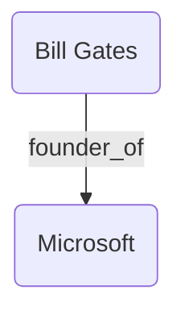

# Demo SimGRAG (Fact Verification with Knowledge Graphs)

Thư mục này là phiên bản nâng cấp, tích hợp **Clean Architecture** (chia BE, FE) và Data Pipeline song song (Spark + vector + graph DBs) để hỗ trợ quá trình **Kiểm chứng sự thật (Fact Verification) dựa trên Đồ thị tri thức (Knowledge Graph RAG - SimGRAG)**.

## Thiết lập môi trường với `uv`

Sử dụng công cụ `uv` siêu tốc để quản lý môi trường:

```bash
cd Demo_SimGRAG
uv init
# Cài đặt các package cần thiết
uv add openai pandas tqdm pymilvus neo4j pyspark
```

## Chuẩn bị Database & Services
Hệ thống kết hợp 3 services chính:
- **Ngôn ngữ (LLM + Embedding)**: Ollama chạy local (Model: `nomic-embed-text` cho embedding và model LLM tùy chọn, cổng `11434`).
- **Semantic Search (VectorDB)**: Cụm DB **Milvus** (port `19530`).
- **Graph Search (GraphDB)**: Cụm DB **Neo4j** (port `7476/7689`).

**Khởi động các Database bằng Docker Compose:**
```bash
docker-compose up -d
```
*(Lệnh này sẽ tải và khởi động các container cho Milvus, Neo4j, và ETCD chạy ngầm trên máy)*

> **Yêu cầu LLM:** Đảm bảo Ollama đã được chạy và tải model embedding: `ollama pull nomic-embed-text`

## Chuẩn bị Data Knowledge Graph (ETL Pipeline - Khối lượng rất lớn)

Trường hợp bạn muốn xây dựng Vector/Graph Database từ bộ **Wikidata5m**:

1. **Tải Dữ Liệu Raw:**
   ```bash
   uv run python Data_Pipeline/0_download_data.py
   ```

2. **MapReduce Trích xuất Triplets (với Apache Spark):**
   Chạy lệnh để Map dữ liệu thô sang đỉnh/cạnh:
   ```bash
   uv run python Data_Pipeline/1_extract_triplets.py
   ```

3. **Sinh Vector Embeddings Hàng Loạt (Heavy Task):**
   Tiến trình này mã hóa ~5 triệu đỉnh sang chuẩn n chiều. Do tác vụ rất nặng (yêu cầu GPU chạy trong vài tiếng), hãy xài `nohup` để chống rớt kết nối:
   ```bash
   mkdir -p logs
   nohup uv run python Data_Pipeline/2_vectorize_embeddings.py > logs/vectorization_logs.txt 2>&1 &
   ```
   *(Theo dõi tiến trình vectorization bằng `tail -f logs/vectorization_logs.txt`)*

4. **Nạp dữ liệu Batch vào Database (Milvus & Neo4j):**
   Khi tiến trình 3 xong, load toàn bộ 5 triệu Nodes và hàng chục triệu Edges vào cụm DB:
   ```bash
   uv run python Data_Pipeline/3_load_to_db.py --milvus --neo4j
   ```

5. **Embedding các Relation (Mối quan hệ):**
   Vector hóa thông tin relation trên graph đẩy lên Milvus collection `WikidataRelations`:
   ```bash
   uv run python Data_Pipeline/4_embed_relations.py
   ```

6. **Kiểm tra trạng thái Milvus:**
   Liệt kê các Collection hiện có trong Milvus để đảm bảo dữ liệu sẵn sàng:
   ```bash
   uv run python Data_Pipeline/5_list_collections.py
   ```

## Kiểm thử Fact Verification (CLI)

Chạy file test tích hợp quy trình nhận Claim -> Tìm Vector Milvus -> Trích xuất mảng Neo4j -> Dịch Subgraph sang Text -> Đưa LLM kiểm chứng (`SUPPORTED`, `REFUTED`, `NOT ENOUGH EVIDENCE`):

```bash
uv run python test_rag.py
```
*(Chương trình sẽ in ra danh sách 10 Claims có sẵn để bạn nhập số kiểm chứng).*

**Tính năng nổi bật:** Sau mỗi lần kiểm chứng, hệ thống tự động sinh ra file **`subgraph_preview.md`**. Bạn có thể dùng Markdown Previewer của VS Code để xem trực quan sơ đồ Graph bằng **Mermaid** của manh mối được tìm thấy:


## Chạy API Server Backend & Frontend

Nếu muốn gắn giao diện hoàn chỉnh:

1. **Khởi động Backend (FastAPI):**
   ```bash
   cd BE
   uv run uvicorn app.main:app --host 0.0.0.0 --port 8000 --reload
   ```
   *Mở Swagger UI tại: [http://localhost:8000/docs](http://localhost:8000/docs)*

2. **Khởi động Frontend GUI (Streamlit):**
   ```bash
   uv run streamlit run FE/app.py
   ```

## Dọn dẹp (Teardown)

Khi không sử dụng nữa, bạn nên tắt các service để giải phóng RAM và CPU:

1. **Tắt các Database Container (Milvus, Neo4j):**
   ```bash
   docker-compose down
   ```

2. **Dừng Ollama service (nếu chạy nền):**
   ```bash
   sudo systemctl stop ollama
   # Hoặc nếu chạy thủ công qua terminal, tìm PID và kill quá trình:
   # pkill ollama
   ```
