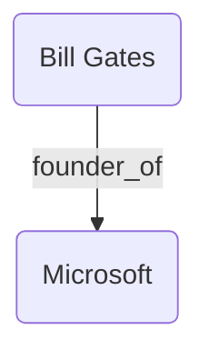

# Demo SimGRAG (Fact Verification with Knowledge Graphs)

Thư mục này là phiên bản nâng cấp, tích hợp **Clean Architecture** (chia BE, FE) và Data Pipeline song song (Spark + vector + graph DBs) để hỗ trợ quá trình **Kiểm chứng sự thật (Fact Verification) dựa trên Đồ thị tri thức (Knowledge Graph RAG - SimGRAG)**.

## Thiết lập môi trường với `uv`

Sử dụng công cụ `uv` siêu tốc để quản lý môi trường:

```bash
cd Demo_SimGRAG
uv init
# Cài đặt các package cần thiết
uv add openai pandas tqdm pymilvus neo4j pyspark requests pyarrow
```

## Chuẩn bị Database & Services
Hệ thống kết hợp 3 khối chính:
- **Ngôn ngữ (LLM Provider)**: Kết nối qua cấu hình `.env` cho phép linh hoạt sử dụng **Ollama** (Local) hoặc Web API như OpenAI, NVIDIA NIM (VD: `OPENAI_BASE_URL=https://integrate.api.nvidia.com/v1`, Model: `qwen/qwen3.5-122b-a10b`).
- **Semantic Search (VectorDB)**: Cụm DB **Milvus** (port `19530`).
- **Graph Search (GraphDB)**: Cụm DB **Neo4j** (port `7476/7689`).

**Khởi động các Database bằng Docker Compose:**
```bash
docker-compose up -d
```

> **Yêu cầu .env:** Cấu hình file `../.env` cho phần Engine LLM trước khi chạy:
> ```env
> OPENAI_API_KEY=YOUR_NVIDIA_OR_OPENAI_KEY
> OPENAI_MODEL=qwen/qwen3.5-122b-a10b
> OPENAI_BASE_URL=https://integrate.api.nvidia.com/v1
> ```
*(Lệnh này sẽ tải và khởi động các container cho Milvus, Neo4j, và ETCD chạy ngầm trên máy)*

> **Lưu ý quan trọng về Embedding Model:** Hệ thống sử dụng thư viện `SentenceTransformer` với model `all-mpnet-base-v2` cho toàn bộ quá trình mã hóa (cả Index lẫn lúc Query). Điều này là bắt buộc để duy trì hệ không gian vector (Vector Space) nhất quán, từ đó giữ cho phép tính L2 Distance hoạt động chính xác trong quá trình Subgraph Isomorphism. Tuyệt đối không bật L2 Normalize khi truy vấn nếu lúc Index dữ liệu chưa được Normalize!

## Chuẩn bị Data Knowledge Graph (ETL Pipeline - Khối lượng rất lớn)

Trường hợp bạn muốn xây dựng Vector/Graph Database từ bộ **Wikidata5m**:

1. **Tải Dữ Liệu Raw:**
   ```bash
   uv run python Data_Pipeline/0_download_data.py
   ```

2. **MapReduce Trích xuất Triplets (với Apache Spark):**
   Spark đọc song song 3 file raw (entities, relations, triplets), parse và lưu thành Parquet phân vùng:
   ```bash
   uv run python Data_Pipeline/1_extract_triplets.py
   ```
   *Kết quả: `output/nodes.parquet`, `output/relations.parquet`, `output/edges.parquet`*

3. **Sinh Vector Embeddings cho Nodes (Heavy Task):**
   Spark dùng Pandas UDF chia batch tải model `all-mpnet-base-v2` lên nhiều GPU/Worker để vector hóa ~5 triệu đỉnh. Do tác vụ rất nặng (chạy trong vài tiếng), hãy dùng `nohup` để chống rớt kết nối:
   ```bash
   mkdir -p logs
   nohup uv run python Data_Pipeline/2_vectorize_embeddings.py > logs/vectorization_logs.txt 2>&1 &
   ```
   *(Theo dõi tiến trình bằng `tail -f logs/vectorization_logs.txt`)*

4. **Sinh Vector Embeddings cho Relations (Mối quan hệ):**
   Spark vector hóa bảng relation rồi lưu ra Parquet (cùng pattern với bước 3):
   ```bash
   nohup uv run python Data_Pipeline/4_embed_relations.py > logs/relations_logs.txt 2>&1 &
   ```

5. **Nạp dữ liệu vào Database (Milvus & Neo4j):**
   Spark đọc Parquet phân tán, nhiều Worker ghi song song vào DB qua `foreachPartition`:
   ```bash
   uv run python Data_Pipeline/3_load_to_db.py --milvus --neo4j
   ```
   *(Tùy chọn nâng cao: `--milvus-host`, `--milvus-port`, `--neo4j-uri`, `--neo4j-user`, `--neo4j-password`)*

6. **Kiểm tra trạng thái Milvus:**
   Liệt kê các Collection hiện có trong Milvus để đảm bảo dữ liệu sẵn sàng:
   ```bash
   uv run python Data_Pipeline/5_list_collections.py
   ```

## Kiểm thử Fact Verification (CLI)

Chạy file test tích hợp quy trình nhận Claim -> Tìm Vector Milvus -> Trích xuất mảng Neo4j -> Dịch Subgraph sang Text -> Đưa LLM kiểm chứng (`SUPPORTED`, `REFUTED`, `NOT ENOUGH EVIDENCE`):

```bash
uv run python test_rag.py
```
*(Chương trình sẽ in ra danh sách 10 Claims có sẵn để bạn nhập số kiểm chứng).*

**Tính năng nổi bật:** Sau mỗi lần kiểm chứng, hệ thống tự động sinh ra file **`subgraph_preview.md`**. Bạn có thể dùng Markdown Previewer của VS Code để xem trực quan sơ đồ Graph bằng **Mermaid** của manh mối được tìm thấy:


## Chạy API Server Backend & Frontend

Nếu muốn gắn giao diện hoàn chỉnh:

1. **Khởi động Backend (FastAPI):**
   ```bash
   cd BE
   uv run uvicorn app.main:app --host 0.0.0.0 --port 8000 --reload
   ```
   *Mở Swagger UI tại: [http://localhost:8000/docs](http://localhost:8000/docs)*

2. **Khởi động Frontend GUI (Streamlit):**
   ```bash
   uv run streamlit run FE/app.py
   ```

## Dọn dẹp (Teardown)

Khi không sử dụng nữa, bạn nên tắt các service DB để giải phóng tài nguyên:

**Tắt các Database Container (Milvus, Neo4j, ETCD):**
```bash
docker-compose down
```
*(Vector model `SentenceTransformer` chỉ chạy trong RAM khi khởi chạy Pyspark/FastAPI, nên khi tắt backend/script là tự động giải phóng).*
