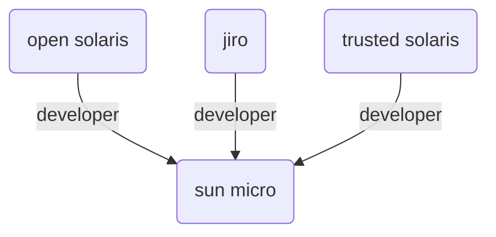

# Subgraph Extraction Preview

**Claim**: Jupiter is the closest planet to the Sun.

**Ground Truth**: False

**LLM Trả Lời**: The provided evidences discuss software developers and products like OpenSolaris and Jiro, containing no information about planetary order or the Sun, and common sense confirms Mercury is the closest planet, not Jupiter. False

Dưới đây là các Facts (Tripets) trích xuất được từ Milvus + Neo4j để làm ngữ cảnh cho LLM:

- `[open solaris] - developer -> [sun micro]`
- `[jiro] - developer -> [sun micro]`
- `[trusted solaris] - developer -> [sun micro]`

## Đồ thị ảo (Mermaid Graph)
*(Bạn có thể ấn nút preview Markdown của VS Code để xem đồ thị này)*

