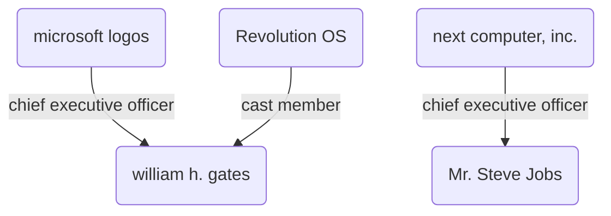

# Subgraph Extraction Preview

**Claim**: Microsoft was founded by Bill Gates.

**Ground Truth**: True

**LLM Trả Lời**: As the provided graphs mention Bill Gates as CEO of Microsoft logos or cast member of Revolution OS but do not state he founded Microsoft, the answer is False

Dưới đây là các Facts (Tripets) trích xuất được từ Milvus + Neo4j để làm ngữ cảnh cho LLM:

- `[microsoft logos] - chief executive officer -> [william h. gates]`
- `[next computer, inc.] - chief executive officer -> [Mr. Steve Jobs]`
- `[Revolution OS] - cast member -> [william h. gates]`

## Đồ thị ảo (Mermaid Graph)
*(Bạn có thể ấn nút preview Markdown của VS Code để xem đồ thị này)*

