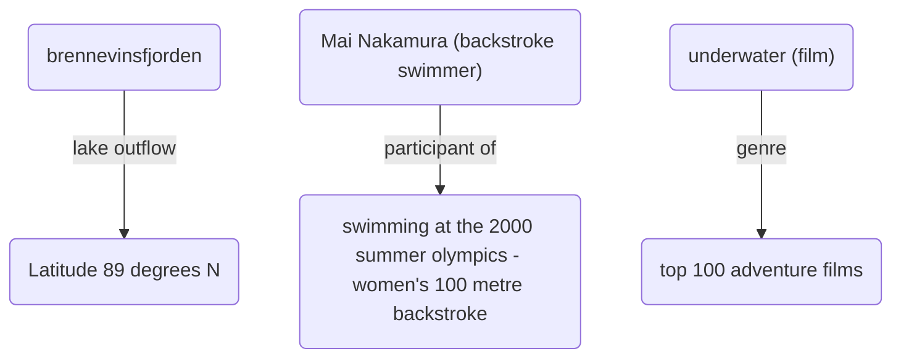

# Subgraph Extraction Preview

**Claim**: Water freezes at 100 degrees Celsius.

**Ground Truth**: False

**LLM Trả Lời**: As the provided evidences do not mention the freezing point of water and common knowledge states water freezes at 0 degrees Celsius, not 100, the answer is False

Dưới đây là các Facts (Tripets) trích xuất được từ Milvus + Neo4j để làm ngữ cảnh cho LLM:

- `[brennevinsfjorden] - lake outflow -> [Latitude 89 degrees N]`
- `[Mai Nakamura (backstroke swimmer)] - participant of -> [swimming at the 2000 summer olympics - women's 100 metre backstroke]`
- `[underwater (film)] - genre -> [top 100 adventure films]`

## Đồ thị ảo (Mermaid Graph)
*(Bạn có thể ấn nút preview Markdown của VS Code để xem đồ thị này)*

